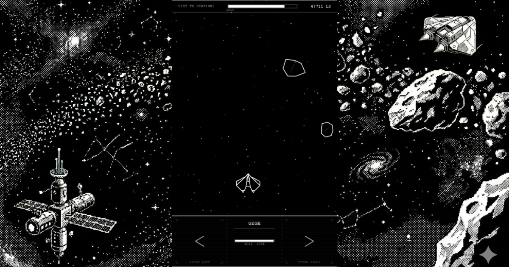

# Flatspace Commander



A 1-bit, vertical-scrolling space trader and combat simulator for the browser — inspired by the Acornsoft/C64 classic *Elite*. Built as a Progressive Web App with pure vanilla JavaScript, HTML5 Canvas, and CSS3. No frameworks, no build tools beyond a cache-busting script.

Live: [flatspace-commander.philipnewborough.co.uk](https://flatspace-commander.philipnewborough.co.uk/)

---

## Features

- **Flight** — Vertical-scrolling space travel between star systems. Dodge asteroids, mine them for minerals, and survive combat encounters en route.
- **Combat** — Canvas-rendered 1-bit wireframe dogfights against pirates, traders, and Thargoid alien ships. Multiple laser types (Pulse, Beam, Military), shield support, enemy burst-fire patterns, and cargo pod drops.
- **Trade** — 17 Elite-style commodities with prices driven by each system's tech level, government type, and economy. Buy low, sell high.
- **Equipment** — Upgrade your Cobra with mining lasers, shield generators, docking computers, a galactic hyperdrive, and more — availability gated by system tech level.
- **Galaxy Map** — A 256-system procedurally generated galaxy using a seeded Linear Congruential Generator (LCG). The galaxy is identical on every device — no server required.
- **Persistence** — Commander progress saved to `localStorage` (credits, inventory, hull, equipment, kill stats, visited systems, mission log).
- **PWA** — Installable to home screen via Web App Manifest. Service Worker pre-caches all assets for fully offline play.
- **Audio** — Positional and ambient audio via [Howler.js](https://howlerjs.com/): laser fire, explosions, docking music (*Blue Danube*), station ambience, mining beam, and UI sounds.

---

## Aesthetic

- **1-bit black and white** — `#000000` background, `#FFFFFF` foreground. Occasional glitch artifacts (horizontal line shifts, RGB-split flickers) on hits and UI transitions.
- **Hybrid UI** — Canvas vector line art for flight and combat; clean brutalist HTML/CSS (monospace fonts) for stations, markets, and menus.

---

## Project Structure

```
public/
├── index.html          # Single-page shell; injects UI dynamically
├── manifest.json       # PWA manifest
├── sw.js               # Service Worker — offline caching
├── css/
│   └── style.css
├── js/
│   ├── main.js         # Core entry point: gameState, Player, Starfield, GameLoop
│   ├── combat.js       # CombatEncounter class, SHIP_CATALOG, wireframe ship renderers
│   ├── procedural.js   # GalaxyGenerator (LCG), market prices, COMMODITIES
│   └── vendor/
│       └── howler.js
├── audio/              # MP3 sound effects and music
└── img/
cache-bust.js           # Bumps ?v= query strings on JS/CSS assets
```

---

## Architecture

| Concern | Detail |
|---|---|
| State | Single `gameState` object — credits, fuel, hull, shields, inventory, equipment, current system, stats |
| Rendering | `requestAnimationFrame` game loop; off-screen canvas for the starfield |
| Galaxy | Seeded LCG (`GALAXY_SEED = 0x5A31`) — 256 systems, deterministic, no server |
| Economy | Classic 17-commodity model; price = base ± tech-level/government variance |
| Combat | `CombatEncounter` class — phases: intro → fighting → result; enemy burst-fire, cargo drops, explosions |
| Ships | 16 wireframe ship types (Sidewinder, Mamba, Krait, Fer-de-Lance, Asp Mk II, Thargoid, …) |
| Audio | Howler.js instances with per-sound volumes; triggered via combat callbacks and UI event delegation |
| PWA | Service Worker (cache-first), Web App Manifest (`standalone` display) |
| Persistence | `localStorage` save/load; all keys cleared on game reset |

---

## Getting Started

No build step required. Serve the `public/` directory from any static file server.

```bash
# Example with Python
cd public
python3 -m http.server 8080
```

To bump asset cache versions after editing JS or CSS:

```bash
npm run cache-bust
```

---

## Tech Stack

- Pure Vanilla JavaScript (ES6+ modules)
- HTML5 Canvas API
- CSS3
- [Howler.js](https://howlerjs.com/) (audio)
- Service Worker + Web App Manifest (PWA)

---

## Licence

See [LICENSE](LICENSE).
